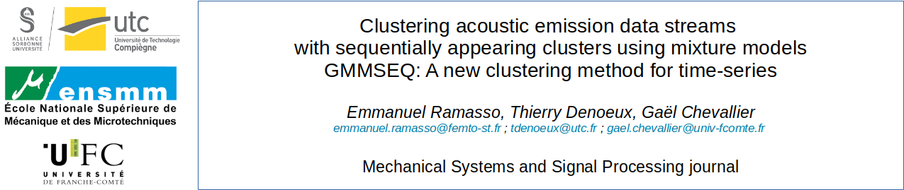
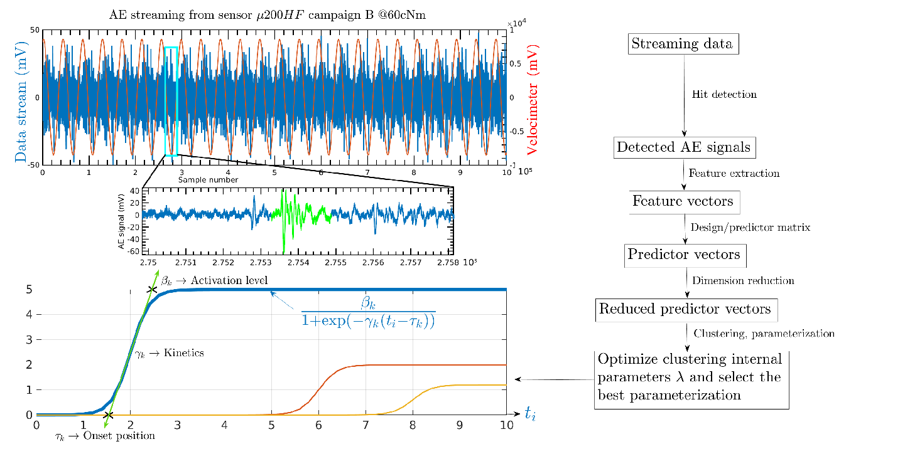

This is the implementation of [1], which makes use of simulated data (reproducible from these codes) as well as real data [2]. For ORION-AE data description, check [2] and its [Dataverse repository](https://doi.org/10.7910/DVN/FBRDU0). 

## GMMSEQ: Gaussian Mixture Model with sequentially appearing clusters

GMMSEQ is a new clustering initially developed to cope with *specificities* of [acoustic emission (AE)](https://www.astm.org/Standards/E1932.htm) signals. But it works with general *time-series* as soon as they are described by *ordered feature vectors with timestamps*. 

GMMSEQ is a generative model that includes the fact that features are indexed by continuous timestamps. The proportions in the GMM are assumed to vary in time according to a model of evolution based on sigmoid functions to represent cumulative occurrence of clusters. 

For [structural health monitoring](https://www.astm.org/Standards/E2983.htm) where acoustic emissions are used to detect damages, each sigmoid function allows us to represent:
- The *level of activation* of a given damage related to the cumulative number of signals generated by this damage;
- The *growth rate* of the damage driven by the slope of the sigmoid function at the origin  and related to the kinetics of the damage; 
- The instant of the damage *onset*. 

Therefore, GMMSEQ makes it possible to identify when a damage first occurs (onset), how it grows (kinetics) and how it accumulates (cluster progression).

The current implementation supports Gaussian distribution, but soon other distributions will be added. 




## Getting Started

Add some folders to the MATLAB path:
```commandline
$ pathdefmixmod
```

The implementation is based on three main codes: 
1. `GMMSEQ_init.m`: to initialize a GMMSEQ model.
2. `GMMSEQ_train.m`: to estimate the parameters of a GMMSEQ model from data.
3. `GMMSEQ_test.m`: to test a GMMSEQ model on new data.

Their use is illustrated with as many comments as possible in `main_test_simulated_data.m`.
Some illustrations are provided with real data [2] in `main_test_real_data.m`.

## Reproduce the results of the paper

Have a look in repository `tests`:
- `main_test_simulated_data_withCriteres_v2.m` allows to focus on Section 1 of the tests.
- `test_selection_models_GMMSEQ_via_histTau.m` allows to focus on Section 2 of the tests. Note that here you need your own features for this part. For information, you can reproduce results of [1] by using features provided in the Drive's link below. 

The set of .mat files available at the [repository link](https://drive.google.com/drive/folders/1H413RxYu4ya7YMEgF_lTh_fHr7flvvOO?usp=sharing) represent a set of features obtained from raw series of measurements in ORION-AE [2]. Features have been obtained by a method described in [1], in Section "Signal Processing" relying on [3]. These features matrices (using variables "P3") allow to reproduce the figures of the paper. 

## Cite

If you make use of this code in your work, please refer to [1]:

```
@article{1,
      title={Clustering acoustic emission data stream with sequentially appearing clusters using mixture models}, 
      author={Emmanuel Ramasso and Thierry Denoeux and Gael Chevallier},
      year={2021},
      journal={Mechanical Systems and Signal Processing},
      note={Submitted},
      publisher={Elsevier}
}
```

If you make use of the data, please refer to [2]:

```
@article{2,
  title={Monitoring a Bolted Vibrating Structure Using Multiple Acoustic Emission Sensors: A Benchmark},
  author={Emmanuel Ramasso and Benoit Verdin and Gael Chevallier},
  journal={Data},
  volume={7},
  number={3},
  pages={31},
  year={2022},
  publisher={Multidisciplinary Digital Publishing Institute}
}
```


If you make use of the features, please refer to [3]:

```
@article{3,
  title={A signal processing approach for enhanced Acoustic Emission data analysis in high activity systems: Application to organic matrix composites},
  author={Kharrat, Mohamed and Ramasso, Emmanuel and Placet, Vincent and Boubakar, ML},
  journal={Mechanical Systems and Signal Processing},
  volume={70},
  pages={1038--1055},
  year={2016},
  publisher={Elsevier}
}
```